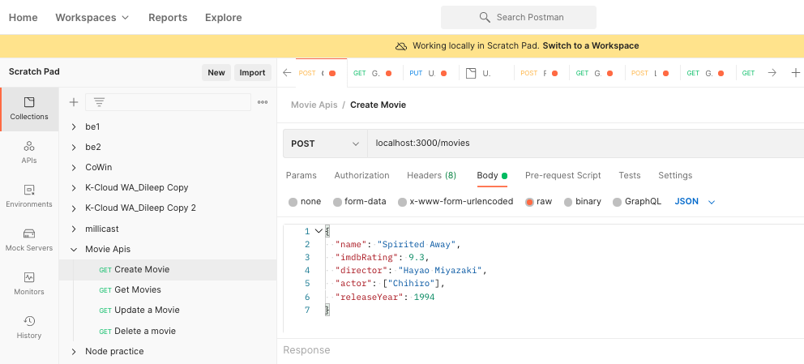

# titaniumaplus

## Project - Books Management

### Models
- User Model
```
{ 
  title: {mandatory, enum[Mr, Mrs, Miss]},
  name: {mandatory},
  phone: {mandatory, unique}
  email: {mandatory, valid email, unique}, 
  password: {mandatory, minLen 8, maxLen 15},
  address: {
    street,
    city,
    pincode
  },
  createdAt,
  updatedAt,
}
```

- Books Model
```
{ 
  title: {mandatory, unique},
  excerpt: {mandatory}, 
  userId: {mandatory, refs to user model},
  ISBN: {mandatory, unique}
  category: {string, mandatory},
  subcategory: {string, mandatory },
  reviews: {number, default 0, comment: Holds number of reviews of this book}
  createdAt, 
  updatedAt,
  deletedAt: {when the document is deleted}, 
  isDeleted: {boolean, default: false},
  releasedAt: {Date, mandatory}
}
```

- Review Model (Books review)
```
{
  bookId: {mandatory, refs to book model},
  reviewedBy: {string, mandatory, default 'Guest', value: reviewer's name},
  reviewedAt: {Date, mandatory},
  rating: {number, min 1, max 5, mandatory},
  review: {string, optional}
}
```

## User APIs 
### POST /register
- Create a user - atleast 5 users
- Create a user document from request body.
- Return HTTP status 201 on a succesful user creation. Also return the user document. The response should be a JSON object like [this](#successful-response-structure)
- Return HTTP status 400 if no params or invalid params received in request body. The response should be a JSON object like [this](#error-response-structure)

### POST /login
- Allow an user to login with their email and password.
- On a successful login attempt return a JWT token contatining the userId, exp, iat. The response should be a JSON object like [this](#successful-response-structure)
- If the credentials are incorrect return a suitable error message with a valid HTTP status code. The response should be a JSON object like [this](#error-response-structure)

## Books API
### POST /books
- Create a book document from request body. Get userId in request body only.
- Make sure the userId is a valid userId by checking the user exist in the users collection.
- Return HTTP status 201 on a succesful book creation. Also return the book document. The response should be a JSON object like [this](#successful-response-structure) 
- Create atleast 10 books for each user
- Return HTTP status 400 for an invalid request with a response body like [this](#error-response-structure)

### GET /books
- Returns all books in the collection that aren't deleted. Return only book title, excerpt, releasedAt, reviews field.
- Return the HTTP status 200 if any documents are found. The response structure should be like [this](#successful-response-structure) 
- If no documents are found then return an HTTP status 404 with a response like [this](#error-response-structure) 
- Filter books list by applying filters. Query param can have any combination of below filters.
  - By userId
  - By category
  - By subcategory
  example of a query url: books?filtername=filtervalue&f2=fv2
- Return all books sorted by book name in Alphabatical order

### GET /books/:bookId
- Returns a book with complete details including reviews. Reviews array would be in the form of Array.
- Return the HTTP status 200 if any documents are found. The response structure should be like [this](#successful-response-structure) 
- If no documents are found then return an HTTP status 404 with a response like [this](#error-response-structure) 

### PUT /books/:bookId
- Update a book by changing its
  - title
  - excerpt
  - release date
  - ISBN
- Make sure the unique constraints are not violated when a making the update
- Check if the bookId exists (must have isDeleted false and is present in collection). If it doesn't, return an HTTP status 404 with a response body like [this](#error-response-structure)
- Return an HTTP status 200 if updated successfully with a body like [this](#successful-response-structure) 
- Also make sure in the response you return the updated book document. 

### DELETE /books/:bookId
- Check if the bookId exists and is not deleted. If it does, mark it deleted and return an HTTP status 200 with a response body with status and message.
- If the book document doesn't exist then return an HTTP status of 404 with a body like [this](#error-response-structure) 

## Review APIs
### POST /books/:bookId/review
- Add a review for the book in reviews collection.
- Check if the bookId exists and is not deleted before adding the review. Send an error response with appropirate status code like [this](#error-response-structure) if the book does not exist
- Get review details like review, rating, reviewer's name in request body.
- Update the related book document by increasing its review count
- Return the updated book document with reviews data on successful operation. The response body should be in the form of JSON object like [this](#successful-response-structure)

### PUT /books/:bookId/review/:reviewId
- Update the review - review, rating.
- Check if the bookId exists and is not deleted before updating the review. Check if the review exist before updating the review. Send an error response with appropirate status code like [this](#error-response-structure) if the book does not exist
- Get review details like review, rating, reviewer's name in request body.
- Update the related book document by increasing its review count
- Return the updated book document with reviews data on successful operation. The response body should be in the form of JSON object like [this](#successful-response-structure)

### Authorisation
- Make sure that only the owner of the books is able to edit or delete the book.
- In case of unauthorized access return an appropirate error message.

## Testing 
- To test these apis create a new collection in Postman named Project 1 bookging 
- Each api should have a new request in this collection
- Each request in the collection should be rightly named. Eg Create author, Create book, Get books etc
- Each member of each team should have their tests in running state

Refer below sample
 

## Response

### Successful Response structure
```yaml
{
  status: true,
  message: 'Success',
  data: {

  }
}
```
### Error Response structure
```yaml
{
  status: false,
  message: ""
}
```

## Collections
### books
```yaml
{
  "title": "How to win friends and influence people",
  "excerpt": "book body",
  "category": "Book",
  "subcategory": "Non fiction", "Self Help"],
  "deleted": false,
  "deletedAt": "", // if deleted is true deletedAt will have a date 2021-09-17T04:25:07.803Z,
  "releasedAt": "2021-09-17T04:25:07.803Z"
  "createdAt": "2021-09-17T04:25:07.803Z",
  "updatedAt": "2021-09-17T04:25:07.803Z",
}
```

#### Note: Create a group database and use the same database in connection string by replacing `groupXDatabase`